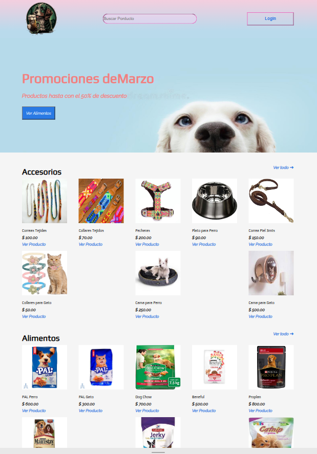

# Challenge ONE | Front End - AluraGeek

     "Esté es un proyecto para el curso que imparte Alura Latam junto a Oracle"

        

**PETRUCHIS:** E-commerce con funcionalidades de CRUD.

Este proyecto es un sitio web de e-commerce desarrollado con HTML, CSS, JavaScript y Node.js para el back-end. Además, utiliza un sistema de gestión de paquetes NPM para asignar un ID único para la identificación de los productos en el sistema.

__Instrucciones y detalles del Proyecto__

El sitio web cuenta con las siguientes funcionalidades de CRUD:

-Crear: Se pueden agregar nuevos productos al sitio web. Para esto, se requiere llenar un formulario con información detallada del producto.
Para agregar una imagen vía URL para mostrar el producto a vender siga estas instrucciones...

1.- Busque imagen deseada, de click derecho y seleccione "Copiar vínculo de la imagen", posterior agregue la URL al formulario. Se puede agregar una imagen desde su dispositivo, pero es necesario agregarla a la carpeta "img" del proyecto ¡¡Por el momento!!

2.- Agregue la categoría del producto (Utilice "accesorios", "alimentos" y "otros" para asignarlo a la sección deseada y que el usuario lo pueda identificar)

3.- Agregue nombre del Producto

4.- Agregue Precio del producto

-Actualizar: Es posible editar la información de un producto existente, para esta funcionalidad se utiliza el ID, el cual nos permite llenar de forma automática el formulario con la información completa del producto para facilitar su edición

-Eliminar: Se puede eliminar un producto del sitio web, utilizando su ID único como identificador.

__Instalación y uso__

Clonar el repositorio del proyecto: git clone https://github.com/usuario/repo.git
Instalar las dependencias de NPM: npm install
Iniciar el servidor: json-server --watch db.json
Acceder al sitio web en el navegador web: http://localhost:3000/producto

__Requisitos previos__

Node.js instalado en el equipo

__COLABORADORES__

Diego Soria
https://github.com/DiegoSoriaArg

Se terminaran y agregaran nuevas funcionalidades para completar más el proyecto (Aun está incompleto, la finalidad es el uso del CRUD)